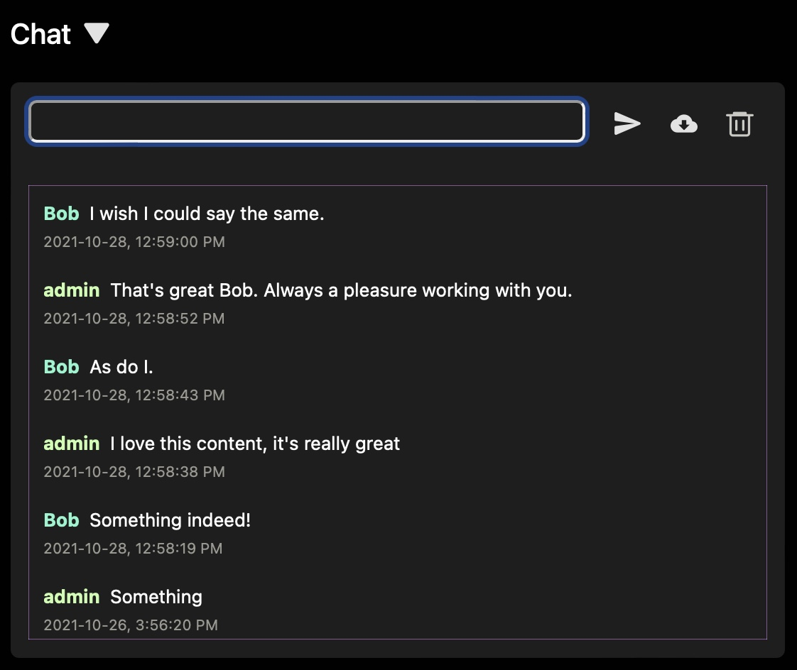

# Text & Video Chat

Streamwell includes a text and video chatroom for every channel. These can be enabled under Administration -> Server -> Settings -> Chat / Video Chat

## Text Chat

Just a simple method of messaging fellow users on a channel without leaving the page. You can download a copy of the chat or clear the history using the buttons on the right:

## Video Chat

Once enabled, joining the video chat will allow you to select a video and audio source, then check your smile before you click 'Start Video' and appear to the other participants:

.jpg>)

Hover over a chat stream to reveal the media controls.  You can mute/unmute the chat stream, reload the chat stream if there is an issue, or 'promote' it up to the main player:

In this example, Wendy is sharing an interesting document so let's promote it up to the main player. Notice the main live stream tucks away in the chat viewer until you put it back:

Note: in-browser screen sharing and the SD/HD resolution toggle is only available in Google Chrome, because the other browsers do such a poor job of it. If you choose HD resolution, make sure everybody has a solid connection and allow 20-30 seconds for the video quality to ramp up (browsers are not great at sending streaming video).

Note: There is no imposed cap on the number of participants, but 4 or 5 is a reasonable maximum since each additional participant adds bandwidth and processing overhead.

Note: Apple controls all web browsers on the iPhone, as well as the implementation of WebRTC which is the technology used to deliver low-latency video. They have a tendency to break this when they update it, especially the parts that handle transmitting video. So if you are having video chat issues on iPhone or iPad (iOS 15.1 for example introduced breaking changes when transmitting H264 over WebRTC), don't troubleshoot them too hard...
