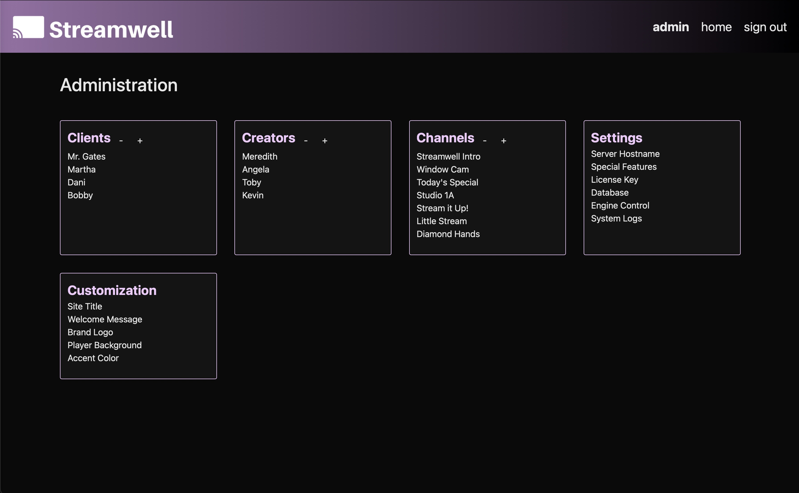

# Users & Channels

## **Users**

There are two regular user roles, _client _and _creator_.

_Clients _can log in and choose from a list of channels which reveal only the channel name and notes. If text or video chat are enabled, they can participate and view these as well.

_Creators _can see the above plus when the channel was created, the public share link, the stream key and server info for incoming streams. Also available to creators are: stream recordings, file uploads and live stream statistics.

Use the + and - buttons to add and delete clients and creators, or click on one to edit it:

## **Channels**

Each channel is like a private workspace centered around a live stream. Every channel has a name, some optional notes, and a list of allowed Clients and Creators. Clients on the allow list will see the channel when they log in, and Creators on the allow list will also see the stream key + public link. This can be edited to allow/revoke access to channels as needed.

For ease of access, channels also offer a one-tap Public Link which you can share with anybody you’d like to give direct access to that stream. Yes, it’s that easy.

Note that when accessing Streamwell via a Public Link, users will see **only** the channel name and notes.

.png>)

